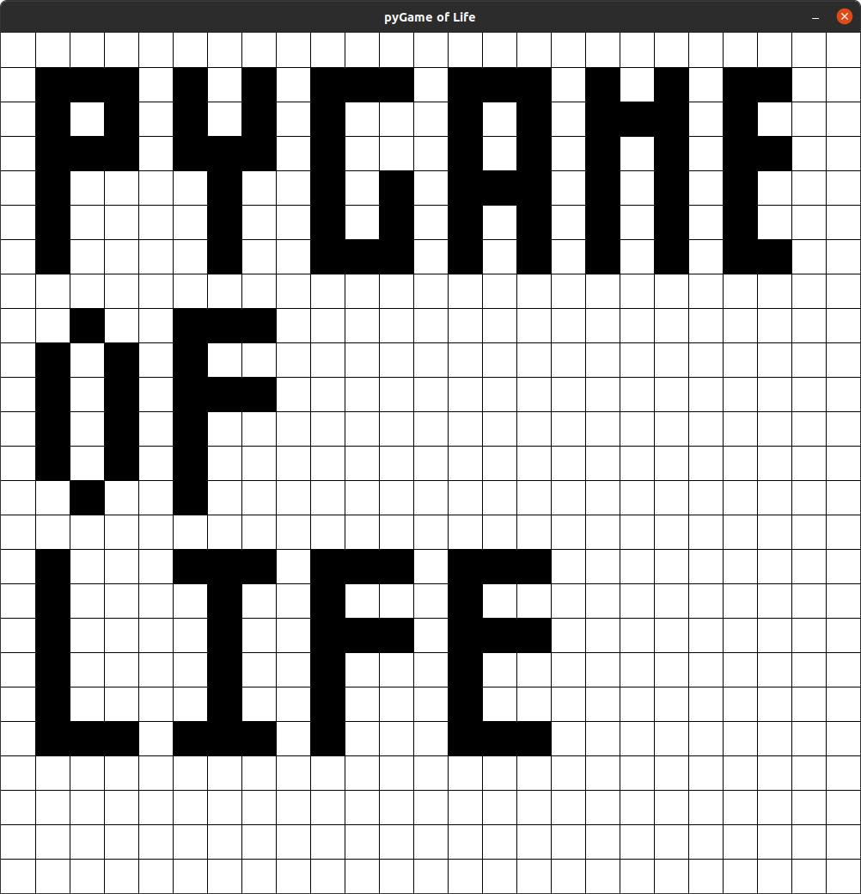

.. pyGame of Life documentation master file, created by
   sphinx-quickstart on Sun Apr 17 12:17:59 2022.
   You can adapt this file completely to your liking, but it should at least
   contain the root `toctree` directive.

pyGame of Life
==========================================

===========
Description
===========

pyGame of Life is a Python Game of Life implementation built using a Pygame frontend.

See the installation section for build instructions.

============
Dependencies
============
Below are the pypi pages for project's main dependencies. Both can be install from pip.

* `Pygame <https://pypi.org/project/pygame/>`_
* `EasyGUI <https://pypi.org/project/easygui/>`_

.. toctree::
   :maxdepth: 2
   :caption: Contents:

   installation
   classes
   usage
   support

Indices and tables
==================
* :ref:`genindex`
* :ref:`search`